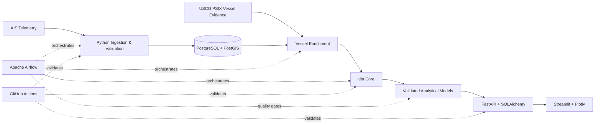

# CargoPulse

## Point-in-Time LNG Operational Pressure Intelligence

CargoPulse is an end-to-end alternative-data engineering and research platform that transforms continuous AIS vessel telemetry into validated LNG terminal events, point-in-time operational features, and an explainable terminal-pressure index.

The project is built around a simple principle: **every analytical output should remain traceable to the physical evidence and information set that existed at the time it was measured**. Raw vessel movements are therefore reconstructed into berth and terminal events, validated through geospatial and identity controls, transformed through tested analytical models, and served through a decoupled API and dashboard architecture.

> **Technical report:** [CargoPulse Institutional Engineering & Research Report](docs/CargoPulse_Institutional_Engineering_Research_Report.pdf)

---

## Research Objective

Raw AIS data is a movement record, not a decision product. By itself, it cannot distinguish:

- a busy terminal from a capacity-constrained terminal;
- a normal berth stay from abnormal operational delay;
- a one-day utilisation spike from persistent congestion;
- high infrastructure use from accumulating vessel-flow pressure.

CargoPulse addresses that gap by constructing an auditable analytical chain:

```text
AIS telemetry
    ↓
validated vessel identity
    ↓
terminal / berth event reconstruction
    ↓
operational metrics
    ↓
point-in-time historical baselines
    ↓
pressure features
    ↓
explainable operational-pressure index
```

The central research question is:

> **Can continuous maritime telemetry be transformed into auditable point-in-time indicators of LNG terminal congestion and saturation without look-ahead bias, forced imputation, or loss of data provenance?**

---

## Validated Scope

The current validated research scope is **Sabine Pass LNG terminal, January 2023**.

| Measure | Validated result |
|---|---:|
| Confirmed LNG terminal calls | 34 |
| Daily point-in-time pressure observations | 30 |
| dbt analytical models | 22 |
| dbt data tests | 161 |
| Validated dbt build | 183 / 183 passed |
| Python test suite | 36 / 36 passed |

The latest validated state in the research period is **52.8 / 100** with high confidence, alongside **99.9% terminal utilisation**, peak occupancy of **3 / 3 modelled berths**, and **81.4% trailing three-day utilisation**. The decomposition indicates a capacity-led and persistent operating state rather than a vessel-backlog-led one.

---

## What CargoPulse Measures

CargoPulse converts vessel and infrastructure behaviour into a small set of physically interpretable variables.

| Variable | Interpretation |
|---|---|
| **Capacity utilisation** | Share of modelled berth capacity consumed over a day |
| **Berth saturation** | Peak simultaneous berth occupancy relative to modelled capacity |
| **Abnormal operational delay** | Active-call duration above the applicable historical expectation |
| **Persistence** | Trailing utilisation used to distinguish transient spikes from sustained pressure |
| **Vessel balance** | Short-horizon arrivals versus departures used to identify accumulation or clearing |

**Abnormal operational delay is not contractual demurrage.** It is an operational screening signal; any demurrage conclusion would require contractual laytime terms and independent commercial evidence.

---

## System Architecture

CargoPulse deliberately separates ingestion, geospatial state, analytical transformations, orchestration, serving, and presentation.



### Engineering layers

| Layer | Responsibility |
|---|---|
| **Python ingestion** | Cleaning, type normalisation, timestamp handling, duplicate control and staging |
| **PostgreSQL + PostGIS** | Durable relational state, vessel positions, spatial indexes, terminal and berth geometry |
| **Vessel enrichment** | Identity validation and LNG-carrier classification using external vessel evidence |
| **dbt Core** | Staging, intermediate models, operational events, baselines, features, index calculations and tests |
| **Apache Airflow** | Pipeline ordering, retries, orchestration and execution visibility |
| **FastAPI + SQLAlchemy** | Read-only analytical service boundary between stored analytics and consumers |
| **Streamlit + Plotly** | Presentation and interactive analytical exploration |
| **Docker Compose** | Reproducible multi-service runtime |
| **GitHub Actions** | Automated linting, testing, integration and deployment-oriented validation |

The dashboard does **not** own the analytical logic and does **not** query PostgreSQL directly. Analytical state is produced upstream and exposed through the API boundary.

---

## Point-in-Time Correctness

Point-in-time correctness is a model requirement, not a presentation feature.

For a metric date `t`, CargoPulse allows a historical duration baseline to use only calls whose berth departure occurred **before `t`**. Future operating information is structurally excluded from earlier observations.

The research controls are:

- **Point-in-time baselines** — only historically available completed calls enter each date's comparison set.
- **Berth-first hierarchy** — berth-specific history is preferred when sufficient evidence exists; otherwise the model falls back to terminal-wide history.
- **No forced imputation** — insufficient historical evidence remains insufficient rather than being replaced by a fabricated expected value.
- **Censoring preservation** — calls intersecting dataset boundaries remain censored.
- **Explicit review states** — continuity or detection uncertainty remains visible in the model state.
- **Separate confidence** — evidence quality is reported independently from operational-pressure magnitude.

This prevents clean-looking output from being created by silently discarding uncertainty.

---

## Operational-Pressure Index

The daily index is an explainable weighted aggregation of seven normalised operational components. It is capped at 100 and is intended to compare terminal operating regimes through time.

| Component | Maximum points |
|---|---:|
| Capacity pressure | 20 |
| Berth saturation | 10 |
| Active-delay share | 20 |
| Severe-delay share | 15 |
| Delay intensity | 10 |
| Trailing 3-day utilisation | 15 |
| Vessel-balance pressure | 10 |
| **Total** | **100** |

The coefficients are intentionally explicit and reproducible.

They are currently **heuristic baseline coefficients**, selected for transparency and diagnostic usefulness. They are **not statistically estimated economic sensitivities**. A subsequent research stage would compare this benchmark with statistically estimated alternatives against clearly defined out-of-sample operational or market targets.

---

## Analytical Outputs

The project produces analytical views at several levels.

### Terminal level

- daily capacity utilisation;
- peak berth saturation;
- arrivals and departures;
- trailing utilisation;
- vessel-balance pressure;
- operational-pressure regime and decomposition.

### Berth level

- berth utilisation;
- call counts;
- historical duration baselines;
- estimated abnormal operational delay;
- localisation of potential operating bottlenecks.

### Call level

- validated vessel identity;
- terminal and berth assignment;
- arrival and departure timestamps;
- observed duration;
- abnormal-delay estimate;
- severity state;
- censoring and review status.

The aggregate index therefore remains traceable back to individual operational observations.

---

## Asset-Level Operational Diligence

CargoPulse is designed to move from terminal-wide pressure to the underlying operating evidence.

Within the validated research period, berth utilisation was broadly balanced across the three modelled berths, while estimated abnormal operational delay differed. This allows the analysis to **localise where further operating diligence should concentrate without asserting a causal fault from the metric alone**.

The analytical sequence is:

```text
identify aggregate pressure
        ↓
localise the operating bottleneck
        ↓
inspect berth- and call-level evidence
        ↓
separate operational, structural and data-quality explanations
        ↓
only then consider capacity or capital implications
```

---

## Repository Structure

```text
cargopulse/
├── .github/
│   └── workflows/              # Continuous-integration workflow
│
├── airflow/
│   └── dags/                   # Airflow orchestration DAG
│
├── api/
│   ├── db/                     # Database session / connection layer
│   ├── routes/                 # Analytical API endpoints
│   ├── schemas/                # API response models
│   └── services/               # Query and service logic
│
├── config/                     # Application configuration
├── dashboard/                  # Streamlit application and API client
├── database/                   # Database setup / loading utilities
│
├── dbt/
│   ├── models/
│   │   ├── staging/            # Source standardisation
│   │   ├── intermediate/       # Geospatial and operational event logic
│   │   ├── analytics/          # Calls, baselines and berth / terminal metrics
│   │   └── risk/               # Internal pressure-feature/index models
│   └── tests/                  # Analytical data-quality assertions
│
├── enrichment/                 # Vessel identity and classification
├── ingestion/                  # AIS inspection and cleaning
│
├── pipeline/
│   ├── stages/                 # Ingest, validate, load, enrich, transform,
│   │                           # detect calls, export and quality-gate stages
│   ├── cli.py                  # Pipeline CLI
│   ├── config.py               # Pipeline configuration
│   └── runner.py               # Pipeline execution
│
├── processing/                 # Geofence fitting and spatial processing
├── scripts/                    # Shell execution helpers
├── sql/                        # Phase-based analytical SQL
│
├── tests/
│   ├── unit/                   # Unit tests
│   ├── integration/            # API / database / pipeline integration tests
│   ├── regression/             # Historical-output regression tests
│   └── fixtures/               # CI database fixtures
│
├── data/
│   ├── raw/                    # Source AIS data
│   ├── bronze/                 # Early-stage persisted data
│   ├── silver/                 # Cleaned / structured analytical data
│   ├── gold/                   # Exported analytical outputs
│   └── reference/              # Geofences and supporting reference evidence
│
├── docs/
│   ├── CargoPulse_Institutional_Engineering_Research_Report.pdf
│   └── CargoPulse_Institutional_Engineering_Research_Report.docx
│
├── docker-compose.yml
├── Dockerfile
├── Dockerfile.airflow
├── requirements.txt
├── requirements-dev.txt
├── requirements-airflow.txt
├── requirements-dbt.txt
└── README.md
```

> Some internal modules retain the earlier `risk` naming convention. In the research/reporting layer, the index is described as **operational pressure** because it measures congestion and saturation rather than financial capital risk.

---

## Data Layers

CargoPulse follows a staged analytical data model.

```text
RAW
AIS source telemetry
    ↓
BRONZE
persisted source-stage data
    ↓
SILVER
cleaned and structured vessel-position evidence
    ↓
POSTGIS / OPERATIONAL MODELS
validated spatial state and reconstructed terminal events
    ↓
DBT ANALYTICS
calls, baselines, delays, utilisation and pressure features
    ↓
GOLD
exported analytical datasets consumed by downstream services
```

Large source and intermediate datasets are tracked with **Git LFS** rather than stored as normal Git objects.

After cloning:

```bash
git lfs install
git lfs pull
```

---

## Pipeline

The orchestrated workflow follows the sequence:

```text
ingest
  ↓
validate raw
  ↓
load PostgreSQL / PostGIS
  ↓
enrich vessel identity
  ↓
detect / reconstruct operational calls
  ↓
dbt transformations
  ↓
export analytical outputs
  ↓
final quality gate
```

Airflow provides task ordering, retries and execution visibility, while the Python pipeline package exposes the corresponding modular stages.

---

## Local Development

### Prerequisites

- Python 3
- Docker and Docker Compose
- PostgreSQL / PostGIS through the project runtime
- Git LFS

### 1. Clone and retrieve LFS data

```bash
git clone https://github.com/anirudh2003-ai/cargopulse.git
cd cargopulse

git lfs install
git lfs pull
```

### 2. Create a Python environment

```bash
python -m venv .venv
source .venv/bin/activate
pip install -r requirements.txt
```

For development tooling:

```bash
pip install -r requirements-dev.txt
```

### 3. Configure the environment

Use the repository's example environment file as the configuration template:

```bash
cp .env.example .env
```

Populate local values as required. **Do not commit `.env`.**

### 4. Start the containerised services

```bash
docker compose up -d --build
```

### 5. Inspect the pipeline CLI

```bash
python -m pipeline --help
```

### 6. Run the API

```bash
uvicorn api.main:app --reload
```

### 7. Run the dashboard

```bash
streamlit run dashboard/app.py
```

---

## Validation and Reproducibility

CargoPulse treats validation as part of the analytical architecture.

The validated implementation includes:

- source-schema and raw-data checks;
- database and PostGIS validation;
- dbt not-null, uniqueness, accepted-value and relationship tests;
- final analytical quality gates;
- historical regression tests;
- Python unit and integration tests;
- GitHub Actions CI;
- dbt parsing;
- Docker Compose validation;
- Airflow DAG import checks;
- isolated PostGIS integration smoke testing.

Validated report state:

```text
dbt models:       22
dbt data tests:   161
dbt build:        183 passed / 0 errors
Python tests:      36 passed / 0 failures
```

Typical local checks:

```bash
pytest
ruff check .
```

---

## Research Findings

The January 2023 Sabine Pass sample shows that terminal pressure is **episodic rather than monotonic**.

The validated series reaches a peak of **72.5** around 18 January before easing and later returning to an elevated regime near month-end.

At the latest validated observation:

```text
Operational pressure index        52.8 / 100
Terminal utilisation              99.9%
Peak occupied berths              3 / 3
Trailing 3-day utilisation        81.4%

Index contribution:
Capacity                          20.0
Berth saturation                  10.0
Trailing utilisation              12.2
Active delay                       6.7
Delay intensity                    3.9
Severe delay                       0.0
Vessel balance                     0.0
```

The result is therefore interpreted as **capacity-led and persistent**, with secondary abnormal-duration pressure, rather than as a backlog-led event.

---

## Interpretation Boundaries

CargoPulse is deliberately narrow about what its outputs establish.

- The validated scope is **Sabine Pass, January 2023**; no global LNG-market claim is made.
- The operational-pressure index is **not** a probability of supply disruption.
- It is **not** a price forecast.
- It is **not** an investment recommendation.
- It is **not** a demonstrated trading signal.
- Abnormal operational delay is **not** confirmed cargo-loading delay or contractual demurrage.
- AIS gaps, vessel-identity ambiguity and geofence assumptions can affect reconstructed timelines.
- The current index coefficients are heuristic and should be benchmarked against statistically estimated alternatives before predictive claims are made.

These boundaries are intentional: the purpose of the current system is to establish a reproducible, point-in-time operational evidence layer.

---

## Research and Engineering Roadmap

### Statistical calibration

Compare the current transparent heuristic benchmark with statistically estimated specifications using explicit:

- training periods;
- validation periods;
- out-of-sample test periods;
- baseline models;
- feature ablation;
- coefficient stability analysis.

Potential targets include terminal throughput outcomes, LNG regional spreads, shipping rates or exposed assets, without assuming predictive information exists in advance.

### Near-real-time operation

Extend batch ingestion toward near-real-time telemetry and alerting while preserving:

- point-in-time correctness;
- geospatial validation;
- data-quality states;
- provenance;
- reproducibility.

### Multi-terminal extension

Generalise the event-reconstruction and baseline framework beyond the current validated terminal while retaining terminal-specific geospatial and operating assumptions.

---

## Documentation

The repository README is intended as the engineering entry point. The accompanying report contains the full research framing, methodology, validated findings, figures, interpretation boundaries and analytical discussion.

**Read the report:**  
[CargoPulse — Institutional Engineering & Research Report](docs/CargoPulse_Institutional_Engineering_Research_Report.pdf)

---

## Disclaimer

CargoPulse is an engineering and research project. Its outputs are operational analytical measures derived from the stated dataset and methodology. They should not be interpreted as financial advice, an investment recommendation, a forecast of commodity prices, confirmed demurrage, or evidence of a tradable relationship.

